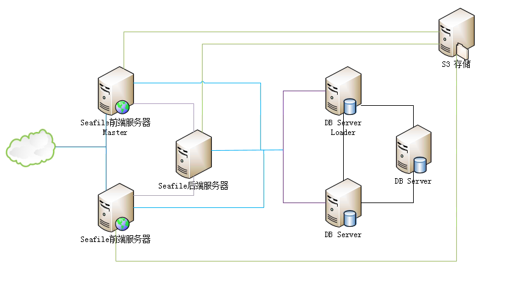

# Seafile 可扩展集群 -- Ansible 自动化部署实现

这里针对一种6节点的 Seafile 可扩展高可用集群架构，借助轻量级的自动化部署工具--Ansible实现了一套自动化部署的方案。
目前，该方案仅针对CentOS 7有效。如果您使用的服务器环境是其他操作系统，也可以将此方案作为一个参考。

该集群架构模型如下所示：



## 介绍

Ansible 是一款轻量级的自动化部署工具，支持通过SSH协议向远程目标服务器发起操作指令。并且无需在远程目标服务器上安装任何客户端工具。虽然如此，但为了执行方便，您应该配置Ansible主机可以免密钥登陆远程目标主机。
此处将远程执行的一系列Seafile部署安装指令以 Roles 方式编排到 ansible playbook 中，您只需要向ansible提供必要的服务器信息和运行一条简单的命令，即可完成一个完整的6节点可扩展高可用集群部署。

## 准备

1. 除了Seafile集群节点外，您还需要一个Ansible主机用来向远程目标主机推送指令。
部署Ansible主机很简单：

```
yum install epel-release -y
yum install ansible -y
```

2. 准备6台干净的 CentOS 7 服务器，并在其上配置允许Ansible主机可以以root身份通过SSH协议免密钥登陆。

3. 下载该项目文件到Ansible主机上任意路径下。
```
git clone https://github.com/haiwen/seafile-ansible
```

4. 修改hosts文件，定义远程主机列表

5. 修改group_vars/all.yml，定义服务器群组变量

6. 创建安装路径，下载Seafile程序包

**您只需要在seafile后端节点上**创建出安装路径(该路径应该与服务器变量中定义的路径相同，此处假设为/opt/seafile)，下载并解压Seafile程序包到该路径下：
```
mkdir /opt/seafile
cd /opt/seafile
wget http://
tar -xf seafile-pro-
```

## 安装

1. 在Ansible主机上运行如下ansible-playbook命令，开始执行自动化安装：

```
ansible-playbook -i hosts site.yml
```

2. 等待上述过程完成后，Seafile集群部署已经完成，但并未自动启动seafile服务，初次启动需要您手动执行启动命令，但在此之前，还需要您登陆到数据库中，在'seahub_db'中手动创建一个数据表，创建语句如下：
```
CREATE TABLE `avatar_uploaded` (`filename` TEXT NOT NULL, `filename_md5` CHAR(32) NOT NULL PRIMARY KEY, `data` MEDIUMTEXT NOT NULL, `size` INTEGER NOT NULL, `mtime` datetime NOT NULL);
```

3. 接下来您可以运行您的Seafile了，进入到您的安装目录，执行以下命令：

```
./seafile-server-latest/seafile.sh start
./seafile-server-latest/seahub.sh start
./seafile-server-latest/seafile-background-tasks.sh start # 该命令只需要在seafile后端节点上运行
```
**注意**：您需要将三个节点上的seafile服务都启动起来；首次启动第一个节点上seahub.sh时，会交互式引导您创建出Seafile管理员账号。

4. 启动成功后，通过负载均衡服务上配置的虚拟IP地址即可访问seafile服务。
